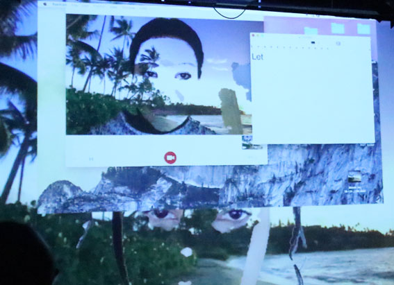

---
# CONFIGURATION
layout: current-artists
rootpath: "../../../"

# ABOUT THE SHOW - GENERIC
artist: "Amy Lawrence"
artist_size: 1
header_image: "header_lawrence.jpg"
season: "Amy Lawrence"

# ABOUT THE SHOW - LAYOUT
# artist_size: 1 # optional - size of artist name 1-5. Default is 1. Set longer names to lower values
# show_size: 2 # optional - size of show name 2-5. Default is 2. Set longer names to lower values
# header_image: "header.jpg" # optional custom background image, relative to current page

---
Amy Lawrence is a multidisciplinary live and visual artist with a practice that encompasses facilitation, curation and creative producing.    

#### *Untitled*                  
       
             
Developed as a Divergency micro-commission with support from hÅb + STUN (Sustained Theatre Up North). Supported using public funding by the National Lottery through Arts Council England.          
         
#### Website          
<a href="http://www.legroomspaceformoving.com" target="_blank">legroomspaceformoving.com</a>
