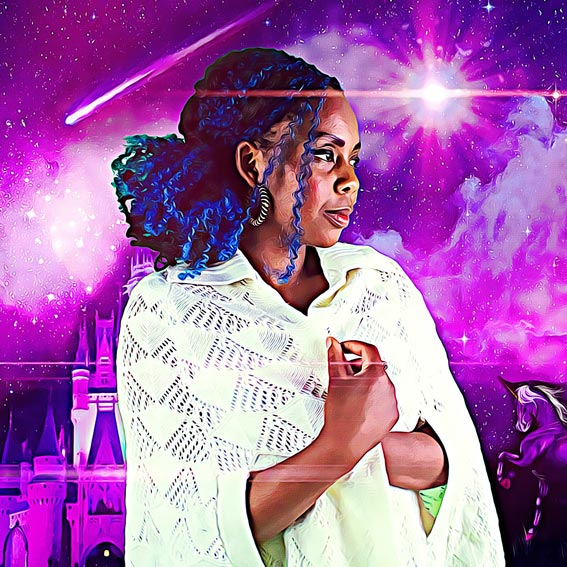

---

# CONFIGURATION
layout: artist
rootpath: "../../../"

# ABOUT THE SHOW - GENERIC
artist: "Nikky Norton Shafau"
show: 
artist_size: 1
show_size: 
header_image: "header_norton.jpg"
season: "Nikky Norton Shafau"

# ABOUT THE SHOW - LAYOUT
# artist_size: 1 # optional - size of artist name 1-5. Default is 1. Set longer names to lower values
# show_size: 2 # optional - size of show name 2-5. Default is 2. Set longer names to lower values
# header_image: "header.jpg" # optional custom background image, relative to current page

---
Nikky Norton Shafau is an artist, poet and storyteller.    

#### *Becoming Storybook*                
My name is Nikky. I am a little bit strange...    
I want to become a Storybook.    
On my 30th birthday in 2015 I decided to create my own job title.    
JOB TITLE:  Storybook    
There you go. See.    
Erm but I wasn't too sure what to do or where to start...    
And so the adventure began trying and failing to become a book. I like the idea of entering the unknown...    

      
   
Developed as a Divergency micro-commission with support from hÅb + STUN (Sustained Theatre Up North). Supported using public funding by the National Lottery through Arts Council England.     
       
         
#### Website          
<a href="https://www.becomingstorybook.com/" target="_blank">becomingstorybook.com</a> 