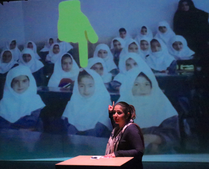

---

# CONFIGURATION
layout: artist
rootpath: "../../../"

# ABOUT THE SHOW - GENERIC
artist: "Mahboobeh Rajabi"
show: 
artist_size: 1
show_size: 
header_image: "header_mahboobeh.jpg"
season: "Mahboobeh Rajabi"

# ABOUT THE SHOW - LAYOUT
# artist_size: 1 # optional - size of artist name 1-5. Default is 1. Set longer names to lower values
# show_size: 2 # optional - size of show name 2-5. Default is 2. Set longer names to lower values
# header_image: "header.jpg" # optional custom background image, relative to current page

---
Mahboobeh Rajabi is a Digital Artist and theatre maker. She use different art forms such as dance, movement and digital skills like animation, as tools to shape her works.  Mahboobeh is passionate about creating innovative performances, using new methods and models of practice from untold cultural stories.      
                      
#### *After Persepolis*                
The journey of a real Persian odyssey that continues into the present day.    
      
   
Developed as a Divergency micro-commission with support from hÅb + STUN (Sustained Theatre Up North). Supported using public funding by the National Lottery through Arts Council England.     
       
         
#### Website          
<a href="http://mahboobeh.co.uk/" target="_blank">mahboobeh.co.uk</a> 