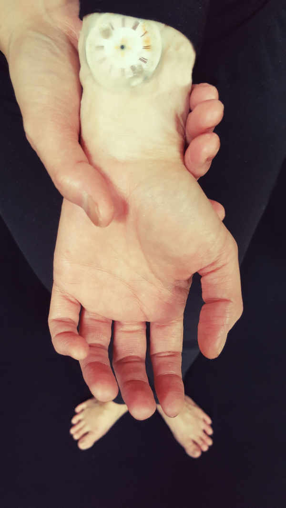

---

# CONFIGURATION
layout: current-events
rootpath: "../../../"
is_index: true

# ABOUT THE SHOW - GENERIC
artist: "Stacy Makishi" # the name of the artist or company
show: "Workshop: Killing Time" # the name of the show
artist_size: 1
show_size: 2
season: "Live Art 20|11|2018"
header_image: "header_makishiflip.jpg"

# ABOUT THE SHOW - LAYOUT
# artist_size: 1 # optional - size of artist name 1-5. Default is 1. Set longer names to lower values
# show_size: 2 # optional - size of show name 2-5. Default is 2. Set longer names to lower values
# header_image: # optional custom background image, relative to current page

---
### Tue 20 Nov 6-9pm 2018  | STUN Studio at Z-arts | FREE     
           
**Workshop: *Killing Time***    
Do you kill your creative ideas before they’re born? Do you notice that the more time you have, the less you get done? Are you constantly getting in your own way?      

Introducing *Killing Time*!     
This workshop that galvanizes participants to:      
Move faster than think    
Create faster than critique      
Resist resistance      
Pulverize procrastination.    

*Killing Time* is a physical workshop that welcomes anyone who is curious about live art and performance. One must have a willingness to try out new ideas and an adventurous spirit to walk out into the unknown.     
            
**About Stacy Makishi**         
Hawaii born <a href="https://www.stacymakishi.co.uk" target="_blank">Stacy Makishi</a> frolics with many forms including live art, film, visual art and physical theatre. She has performed at the Queen Elizabeth Hall, Royal Albert Hall, TATE Modern and at the San Francisco Museum of Modern Art. Stacy Makishi has over twenty years experience as a facilitator and has been carefully cultivating crafty ways to catch artists off-guard. She has taught at Harvard, MIT, UC Berkeley, Wellesley College and University of Massachusetts and has been resident artist and guest lecturer at Queen Mary University, London.      
  
**To join the workshop:**       
If you are an artist of colour, experienced, emerging or just plain curious about exploring live art, we would love for you to join us. To request a place, please email us at <mailto:divergency@habmcr.org>            

**plus on Wed 21 Nov, 7pm at The Lowry | Pay What You Decide.**   
<a href="https://www.thelowry.com/events/stacy-makishi" target="_blank">Stacy Makishi: *The Comforter*</a>    
     

